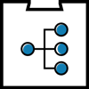

# Eventhandler


The Event Handler can be used to publish and receive events that can be used by other applications.

### Table of contents:

<!--ts-->
   * [Publish event](#publish-event)
      * [Swagger](https://acpaas.digipolis.be/nl/product/event-handler-engine/v2.0.0/api-event-handler-v-2/about#/Publish)
      * [Code Example](#publish-code-example)
   * [Subscribe to event](#subscribe-to-an-event)
      * [Create Subscription](https://wiki.antwerpen.be/ACPAAS/index.php/Event-Handler_User_Manuals) *(internal access needed)*
      * [Code Example](#recieve-event-code-example)
<!--te-->

- [General info](https://acpaas.digipolis.be/nl/product/event-handler-engine)
- [User manual](https://wiki.antwerpen.be/ACPAAS/index.php/Event-Handler_User_Manuals) *(internal access needed)*

## Publish event
**API documentation:** [Swagger](https://acpaas.digipolis.be/nl/product/event-handler-engine/v2.0.0/api-event-handler-v-2/about#/Publish)


#### Publish code example:
```javascript
const request = require('request-promise-native');

const config = {
    host: 'https://api-gw-o.antwerpen.be', // Dev endpoint
    baseUrl: '/acpaas/eventhandler/v2',
    ownerKey: '[OWNERKEY]',
    namespace: '[NAMESPACE]',
    apiKey: '[xxxxx-xxxxx-xxxxx-xxxxx-xxxxx]' // You can find this in your application on the api-store https://api-store-o.antwerpen.be/
}

async function sendEvent(topic, message) {
    try {
        const options = {
            body: message,
            headers: {
                'owner-key': config.ownerKey,
                apikey: config.apiKey
            },
            json: true,
            resolveWithFullResponse: true,
            url: `${config.host}${config.baseUrl}/namespaces/${config.namespace}/topics/${topic}/publish`,
        };
        const response = await request.post(options);
        if (response.statusCode !== 204) {
            console.log(`Success`);
        }

    } catch (error) {
        console.log(`Post error ${error.message} from event handler`);
    }

}
sendEvent('[TOPIC]', '{ datakey: "datavalue"}');
```
## Subscribe to an event

Create an subscription in the Eventhandler that points to your application: [User manual](https://wiki.antwerpen.be/ACPAAS/index.php/Event-Handler_User_Manuals) *(internal access needed)*

The Event Handler will post data to an endpoint.

#### Recieve event code example:
```javascript
// Express route with bodyparser expected

router.post('/message', handleMessage);

function handleMessage(req, res, next) {
  try {
    console.log(`received message ${body}`)
    // Do something
    // Send success
    return res.json();
  } catch (err) {
    console.log(`HandleMessage Error: ${err}`);
    return next(err);
  }
}
```
